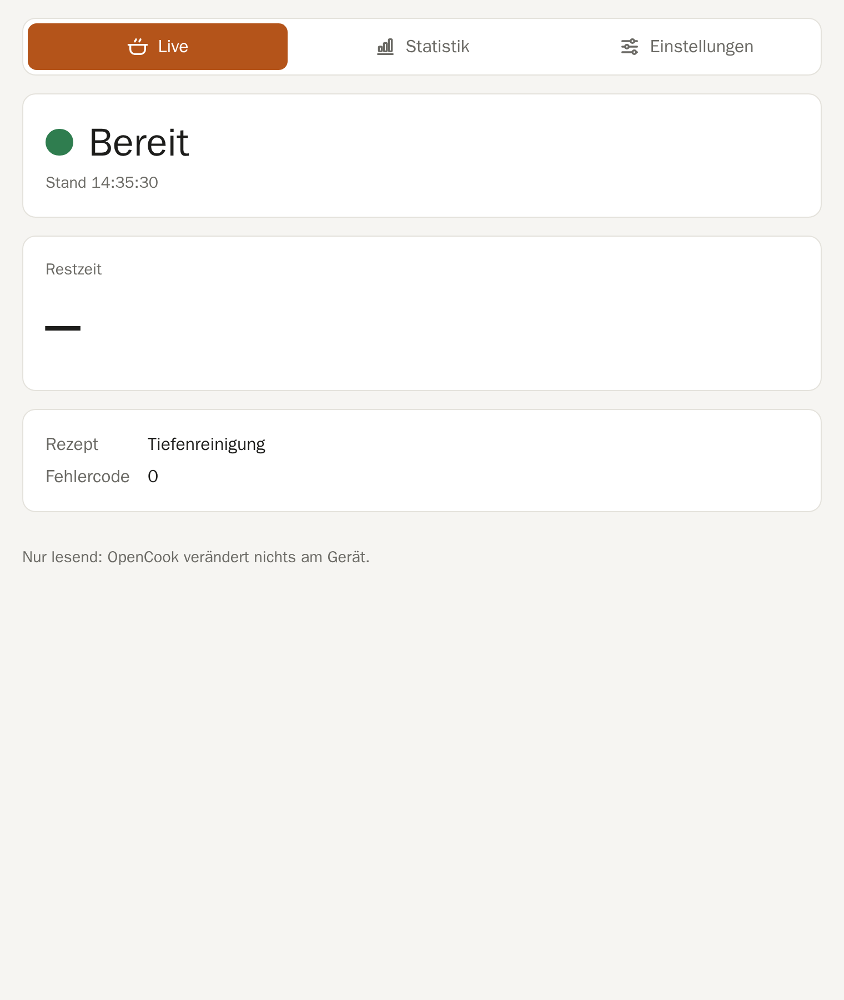
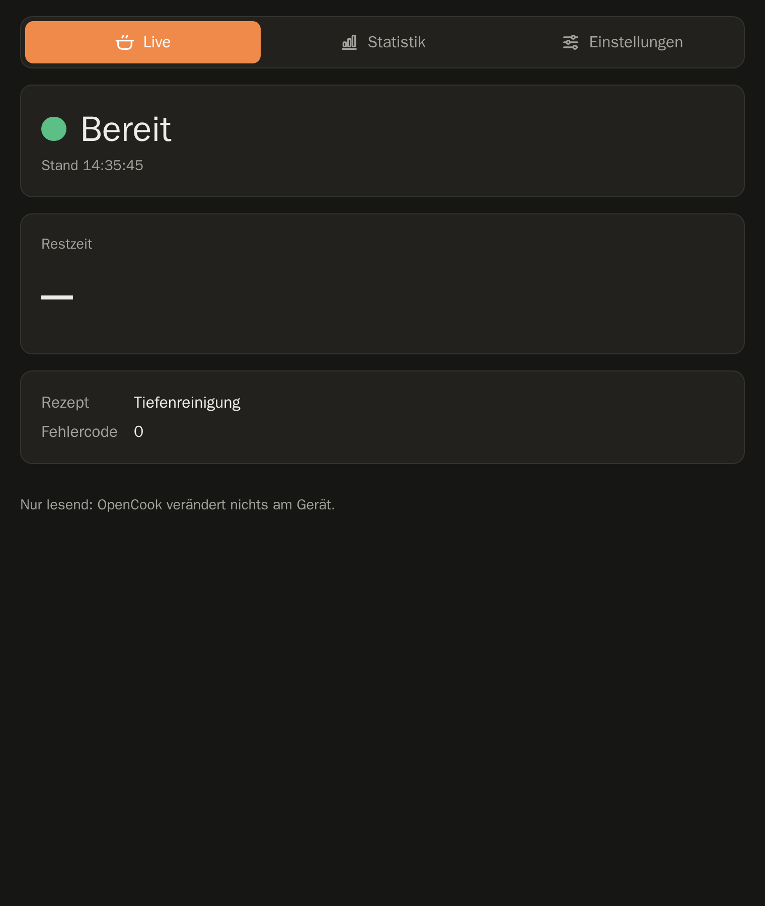
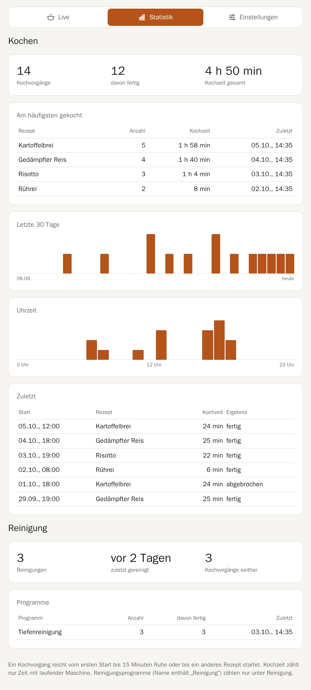
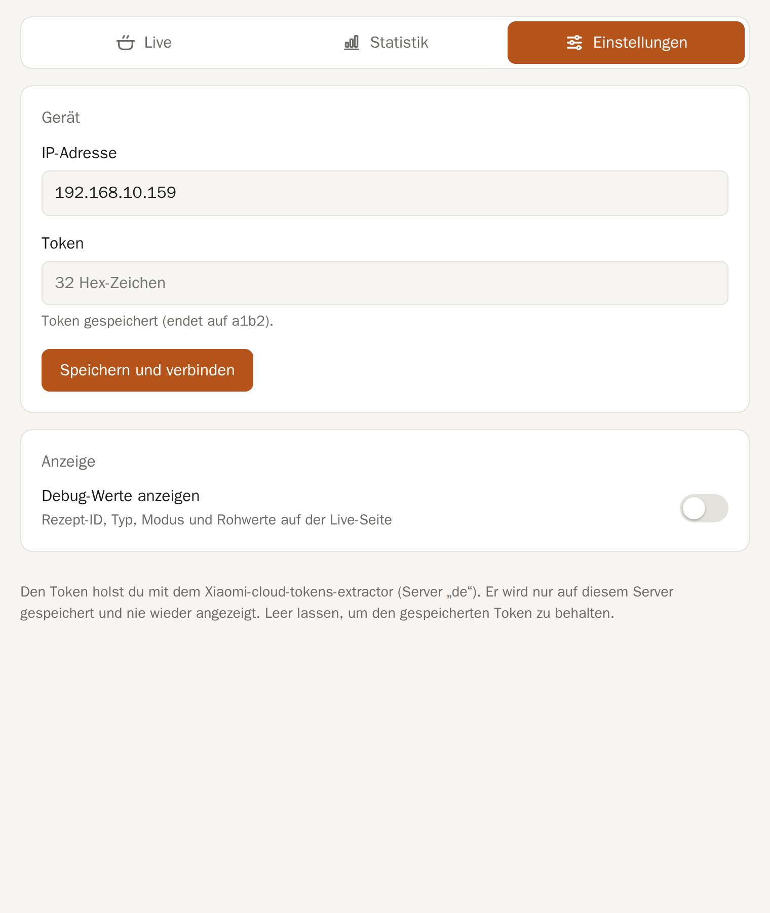
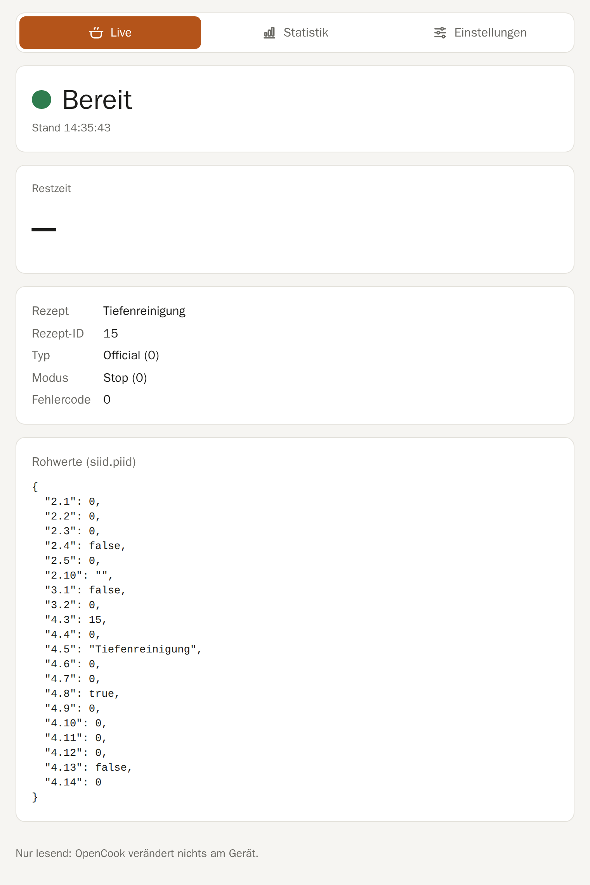
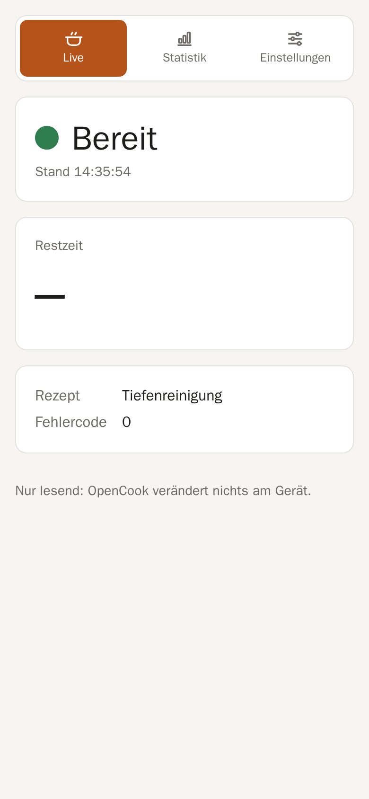

# OpenCook

Lokale, cloudfreie Anbindung des **Xiaomi Smart Cooking Robot** (EU, `chunmi.mfcp.c3os`):
Live-Status im Browser und in Home Assistant, Koch- und Reinigungsstatistik – alles in einem
Docker-Container im eigenen Netz.

> **Nur lesend.** Das Gerät quittiert Schreibbefehle über die lokale Schnittstelle, führt sie aber
> nicht aus (siehe [Protokoll](docs/protocol/xiaomi-c3os.md)). OpenCook liest deshalb nur und
> verändert nichts am Gerät.

<p>
  
  
</p>

## Funktionen

- **Live:** Status (Bereit, Kocht, Pausiert, Fertig, Nicht erreichbar), Restzeit und Rezept,
  sekündlich aktualisiert. Optional Debug-Werte: Rezept-ID, Typ, Modus und alle Rohwerte.
- **Statistik:** Kochvorgänge, fertig gekochte Rezepte, gesamte Kochzeit, häufigste Rezepte,
  die letzten 30 Tage, Uhrzeiten und die letzten Vorgänge.
- **Reinigung:** eigene Auswertung der Reinigungsprogramme – wann zuletzt gereinigt, und wie oft
  seitdem gekocht wurde.
- **Einstellungen:** IP-Adresse und Token des Geräts direkt im Browser ändern; Debug-Werte ein- und
  ausblenden.
- **Home Assistant:** Integration mit Status, Restzeit, „Fertig um“, Rezept und mehr
  ([Anleitung](docs/ha/README.md)).
- Hell und dunkel, am Handy und am Tablet nutzbar.

## Screenshots

| Statistik (Beispieldaten) | Einstellungen |
| --- | --- |
|  |  |

| Debug-Werte eingeblendet | Handy |
| --- | --- |
|  |  |

Dark Mode: [Statistik](docs/screenshots/stats-dark.png) ·
[Einstellungen](docs/screenshots/settings-dark.png) ·
[Debug-Werte](docs/screenshots/live-debug-dark.png).
Die Statistik-Screenshots zeigen Beispieldaten; Live und Einstellungen stammen vom echten Gerät.
Neu erzeugen mit `tools/screenshots.py` (Aufruf steht im Skript).

## Schnellstart

Voraussetzungen: Docker mit Compose auf einem Rechner im selben Netz wie das Gerät (getestet auf
einem Raspberry Pi), dazu IP-Adresse und Token des Geräts.

```bash
git clone https://github.com/nikor30/OpenCook.git
cd OpenCook
docker compose up -d --build
```

Dann `http://<rechner>:8080` öffnen und unter **Einstellungen** IP-Adresse und Token eintragen.
Alternativ beide Werte vorab in eine `.env` schreiben (Vorlage: `.env.example`); im Browser
gespeicherte Einstellungen haben Vorrang.

**Token holen:** mit dem
[Xiaomi-cloud-tokens-extractor](https://github.com/PiotrMachowski/Xiaomi-cloud-tokens-extractor),
Server `de`. Der Token wird nur im Docker-Volume gespeichert (Datei nur für den Dienst lesbar) und
nie wieder über die API ausgegeben.

**Hinweis:** Die Weboberfläche hat keine Anmeldung. Jeder im Netz kann den Status sehen und die
Einstellungen ändern. Nicht ins Internet freigeben.

## Wie gezählt wird

Das Gerät meldet nur, *dass* es läuft und welches Rezept geladen ist. Ein Kochvorgang reicht
deshalb vom ersten Start bis 15 Minuten Ruhe oder bis ein anderes Rezept startet; mehrere Schritte
eines Rezepts zählen als ein Vorgang. Als Kochzeit zählt nur die Zeit mit laufender Maschine.
Reinigungsprogramme erkennt OpenCook am Namen („Reinigung“).

## Entwicklung

```bash
pip install -e "core[dev]"     # Python 3.12+
pre-commit install
pytest -q                      # Tests
pre-commit run --all-files     # ruff, mypy --strict, prettier, gitleaks
```

Oder im Devcontainer (`.devcontainer/`), der alles mitbringt. Projektregeln und Fahrplan:
[CLAUDE.md](CLAUDE.md) und [KICKSTART.md](KICKSTART.md), Architekturentscheidungen in
[docs/adr](docs/adr/).

| Pfad | Inhalt |
| --- | --- |
| `core/opencook/drivers/xiaomi_c3os/` | Read-only-Treiber (miIO, nur `get_properties`) |
| `core/opencook/history/` | Erkennung und Speicherung der Kochvorgänge, Statistik |
| `core/opencook/api/` | FastAPI-App und Weboberfläche |
| `custom_components/opencook/` | Home-Assistant-Integration |
| `docs/protocol/` | Was über das Geräteprotokoll bekannt ist |
| `tools/` | Property-Logger und Screenshot-Skript |

## Rechtliches

Ein Hobbyprojekt zur Interoperabilität mit dem eigenen Gerät; nicht mit Xiaomi verbunden. Das
Repository enthält keine Inhalte, Firmware oder App-Bestandteile von Xiaomi. Lizenz:
[Apache 2.0](LICENSE).
